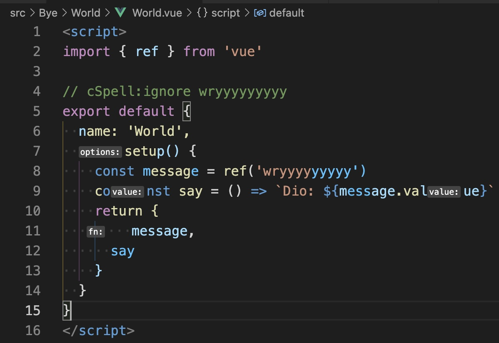

# reproduce-volar-syntax-highlight-bug



## Environments

- OS: MacOS BigSur 11.7
- volar: v1.0.13
- vscode:

  ```txt
  Version: 1.74.0 (Universal)
  Commit: 5235c6bb189b60b01b1f49062f4ffa42384f8c91
  Date: 2022-12-05T16:43:37.594Z
  Electron: 19.1.8
  Chromium: 102.0.5005.167
  Node.js: 16.14.2
  V8: 10.2.154.15-electron.0
  OS: Darwin x64 20.6.0
  ```

## Reproduce steps

1. clone it and install volar and `pnpm i`
2. inspect `src/Hello/World/World.vue` & `src/Bye/World/World.vue`

## Some observation

1. remove jsconfig.json can mitigate

2. rename `Bye/World` to `Bye/WorldWar` and modified `Bye/WorldWar/package.json` by following

```diff
{
- "name": "World",
+ "name": "WorldWar",
  "version": "0.0.0",
  "private": true,
  "main": "./World.vue"
}
```

   and `App.vue` by following

```diff
  <script>
  import HelloWorld from '@/Hello/World'
- import ByeWorld from '@/Bye/World'
+ import ByeWorld from '@/Bye/WorldWar'
```

then everything will be fine.

## Expected

- [ ] find `.vue` path if import folder path from `App.vue` with alias in `jsconfig.json`
- [ ] the type of components in `App.vue` `components` can not be `any`
- [ ] syntax highlight should be correct in every `.vue`
